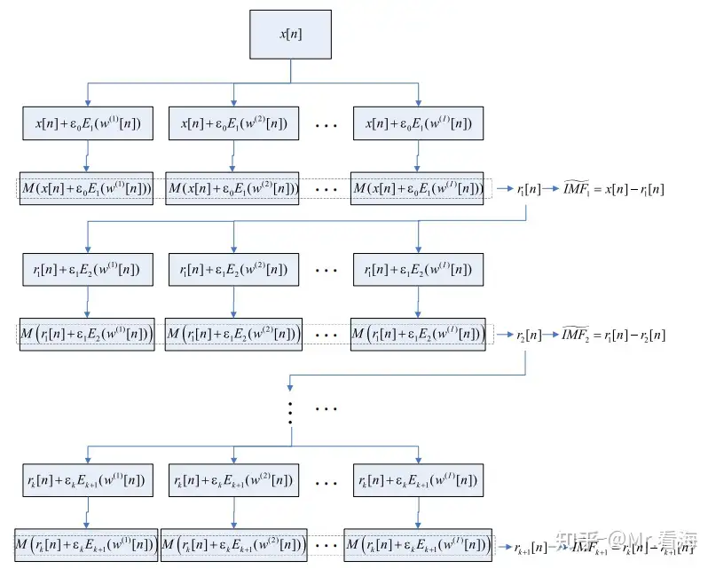

# 改进自适应噪音完备集成经验模态分解(ICEEMDAN)

## 1. 概念：

- ICEEMDAN为解决CEEMDAN的残留噪音和伪模态分量；
- 主要改进点是添加的噪音不是原始白噪音，而是原始白噪音的IMF分量；

## 2. 运算逻辑:

- 算子$E_j(.)$代表求一个信号EMD分解的第j个IMF分量。
- 算子M(.)代表求信号的局部均值。
- $w^l[n]$表第l个白噪音；l为白噪音组数；
- x[n]为原始信号；r[n]为残差信号；
- ε为添加噪音相对于原信号的信噪比；k为IMF个数；

## 3. 优缺点:

优点：缓解了模态混叠和伪模态问题；
缺点：计算复杂度高；参数设置敏感；

## 4. 补充
- 伪模态：在识别或分析过程，出现非物理或非现实意义的模态；
- 局部均值：一个信号进行EMD得到多个IMF，选取符合“局部对称性”和“过零点于极值点数目相匹配”的IMF；

## 5. 相关代码:

[ICEEMDAN](./ICEEMDAN.ipynb)
