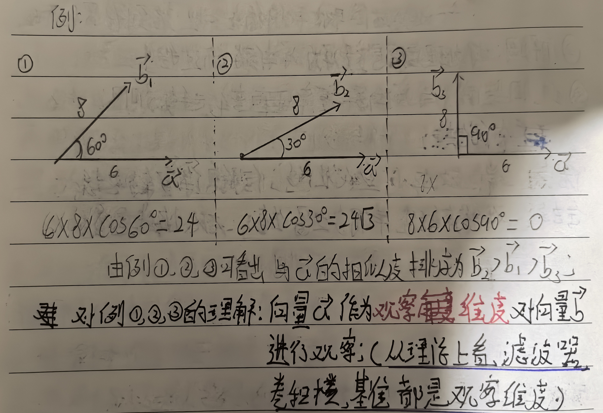
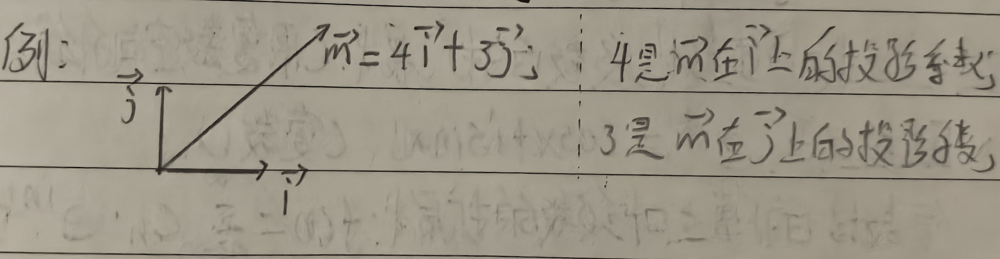

# 傅里叶变换(FT)
> FT从理论上看与卷积层理论一致；(小波变换就特殊的傅里叶变换)
## 1. 基础知识：
### 1.1 点乘的几何意义(正相关)；
向量a与向量b的相似度=$\vec{a} \cdot \vec{b} = \|\vec{a}\| \|\vec{b}\| \cos(\theta)$;

### 1.2 点乘对于观察的缺陷，以及改进方法(投影)：
> 点乘$\vec{a} \cdot \vec{b} = \|\vec{a}\| \|\vec{b}\| \cos(\theta)$;中有$ \|\vec{a}\|$相似度加入了向量$\vec{a}的能量；
> 应用$\vec{a}$的单位向量代替向量$\vec{a}$减少$\vec{a}$能量的影响；
> 注：$\vec{a}$的单位向量是$\vec{a} /  \|\vec{a}\|$

> $\vec{a} /  \|\vec{a}\| \cdot \vec{b} = \|\vec{b}\| \cdot \cos(\theta)$就是$\vec{b}$在$\vec{a}$上的投影，即$\vec{b}$中$\vec{a}$维度的部分；
> 也可以写入 $\frac{1}{\|\vec{a}\|} \cdot \vec{a} \cdot \vec{b}$,其中$\frac{1}{\|\vec{a}\|}$的部分叫归一化；

### 1.3 从两正交的基准(单位向量)作观察维度的优势：
- 基准本身就是单位向量，无须再归一化；
- 以基准分解某个向量：每个基准前的系数都是某维度对应的该向量在该维度上的投影，也就是归一化后的相似度，一般叫投影系数；

### 1.4 在直角坐标系中将函数看作向量来分析点乘：
> 注：由点集角度看连续函数只是更密集的离散函数；

- 现将两个离散函数X(t)，Y(t)看作两个无穷维向量(x1,x2,...,xn),(y1,y2,...,yn);

向量X与向量Y的点乘=$\vec{X(t)} \cdot \vec{Y(t)} = x_1 \cdot y_1 + ... + x_n \cdot y_n$;
从微积分角度看$x_1 \cdot y_1 + ... + x_n \cdot y_n = \sum_{i=1}^{n} x_i \cdot y_i = \int_{t_2}^{t_1} X(t) \cdot Y(t) \, dx$

> 向量X与向量Y的点乘同时是复合函数X(t)Y(t)的积分；也是函数X(t)与Y(t)的内积；(注：内积归一化是卷积)

## 2. 傅里叶级数的解读:

### 2.1 原式解析：

### 2.2 扩展式的解析：

### 2.3 用欧拉公式对傅里叶级数的扩展式：(用复数空间升维)

### 2.4 傅里叶变换：(就求对应$C_n$)

## 3. 短时傅里叶变换(STFT):

## 4. 补充知识:

## 5. 相关代码:

[STFT](./STFT.ipynb)
