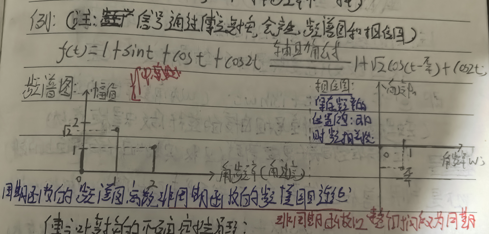
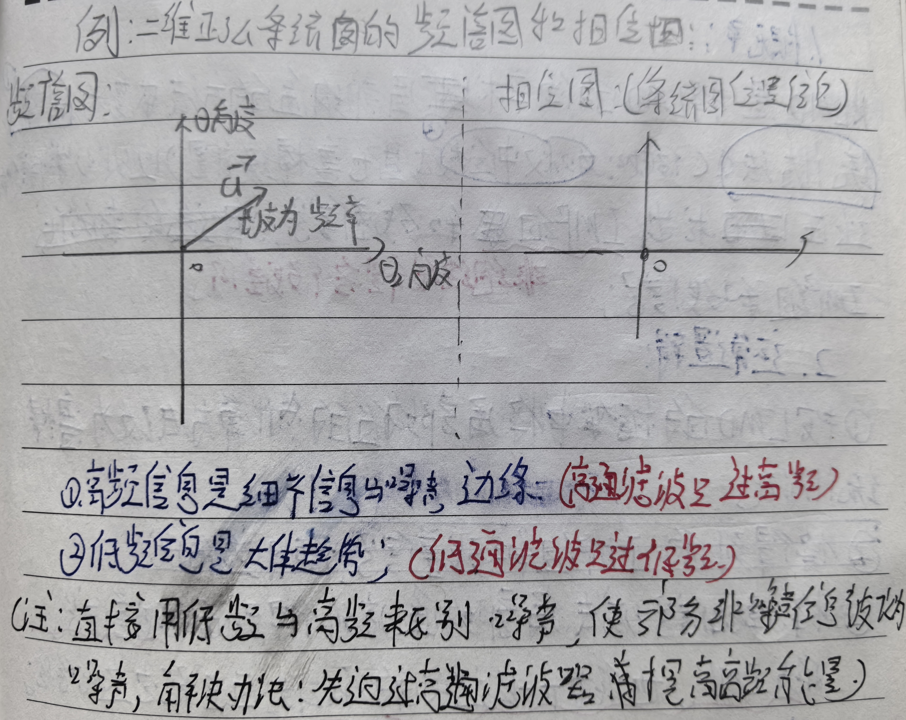

# 傅里叶变换(FT)
> FT从理论上看与卷积层理论一致；(小波变换就特殊的傅里叶变换)
## 1. 基础知识：
### 1.1 点乘的几何意义(正相关)；
向量a与向量b的相似度=$\vec{a} \cdot \vec{b} = \|\vec{a}\| \|\vec{b}\| \cos(\theta)$;

### 1.2 点乘对于观察的缺陷，以及改进方法(投影)：
> 点乘$\vec{a} \cdot \vec{b} = \|\vec{a}\| \|\vec{b}\| \cos(\theta)$;中有$ \|\vec{a}\|$相似度加入了向量$\vec{a}的能量；
> 应用$\vec{a}$的单位向量代替向量$\vec{a}$减少$\vec{a}$能量的影响；
> 注：$\vec{a}$的单位向量是$\vec{a} /  \|\vec{a}\|$

> $\vec{a} /  \|\vec{a}\| \cdot \vec{b} = \|\vec{b}\| \cdot \cos(\theta)$就是$\vec{b}$在$\vec{a}$上的投影，即$\vec{b}$中$\vec{a}$维度的部分；
> 也可以写入 $\frac{1}{\|\vec{a}\|} \cdot \vec{a} \cdot \vec{b}$,其中$\frac{1}{\|\vec{a}\|}$的部分叫归一化；

### 1.3 从两正交的基准(单位向量)作观察维度的优势：
- 基准本身就是单位向量，无须再归一化；
- 以基准分解某个向量：每个基准前的系数都是某维度对应的该向量在该维度上的投影，也就是归一化后的相似度，一般叫投影系数；

### 1.4 在直角坐标系中将函数看作向量来分析点乘：
> 注：由点集角度看连续函数只是更密集的离散函数；

- 现将两个离散函数X(t)，Y(t)看作两个无穷维向量(x1,x2,...,xn),(y1,y2,...,yn);

向量X与向量Y的点乘=$\vec{X(t)} \cdot \vec{Y(t)} = x_1 \cdot y_1 + ... + x_n \cdot y_n$;
从微积分角度看$x_1 \cdot y_1 + ... + x_n \cdot y_n = \sum_{i=1}^{n} x_i \cdot y_i = \int_{t_2}^{t_1} X(t) \cdot Y(t) \, dx$

> 向量X与向量Y的点乘同时是复合函数X(t)Y(t)的积分；也是函数X(t)与Y(t)的内积；(注：内积归一化是卷积)

## 2. 傅里叶级数的解读:

### 2.1 原式解析：
原式：$ f(t)= \frac{a_0}{2} + \sum_{n=1}^{ \infty } (a_n \cdot cos(n \cdot t) + b_n sin(n \cdot t))$;
> 注：基准sin(nx)与cos(nx)的周期都为$ \frac{2π}{n} $；f(t)的周期为2π；

- 众多sin(nx)与cos(nx)都是相互正交的基准(观察维度)；
- 基准对应投影系数a与b可用“正交函数内积为0，自己积自己不为0算出a和b”：$π \cdot a_n = \int_{-π}^{π} f(t) cos(nt) \, dt$;(归一化后为$ a_n = \frac{1}{π} \cdot \int_{-π}^{π} f(t) cos(nt) \, dt$)

### 2.2 扩展式的解析：

扩展式(引入参数“l”使傅里叶级数适应任何周期)：$ f(t)= \frac{a_0}{2} + \sum_{n=1}^{ \infty } (a_n \cdot cos(\frac{πnt}{l}) + b_n sin(\frac{πnt}{l}))$;

> 注1：这样就可以使f(t)的周期变成2l;
> 注2：这里的“l”与小波变换中的尺度参数a一个效果，是控制基准或观察维度的周期，间接控制频率；

- $a_n = \frac{1}{l} \int_{-l}^{l} f(t) \cdot cos(\frac{πnt}{l}) \, dt$;
- 尺度参数l:是用于通过控制周期，间接控制基准的频率；
- 投影系数a,b是原信号在该观察维度上的相似度或幅值或投影系数，具体表现在频谱图上是幅值；(注：不同观察维度的区分标准是频率，n不一样频率不一样)

### 2.3 用欧拉公式对傅里叶级数的扩展式：(用复数空间升维)
复数域的扩展式：$f(t)=\sum_{ n = - \infty}^{\infty} C_n \cdot e^{i \cdot n  \cdot t} $;

> 注：欧拉公式：$e^{ix} = cosx + i \cdot sinx$;(i是复数单位)
> 欧拉公式引入进傅里叶级数相当将只有实数轴X的长度向量，增加一个虚数轴变成了复数平面，使函数变成在复平面上做圆周运动，半径为1，无需归一化；
> 多一个虚数轴，意味着可以将一个时间序列X(t)在时间轴上对实数轴的波浪线运动，变成二维时间序列X(i,t)在在时间轴上对复数和实数构成的平面的螺旋运动；
> 复杂的波浪线，在复数平面(复数和实数构成的平面)是由多个首尾相连连杆做的螺旋运动；

以下是欧拉公式代入傅里叶级数的过程：
1. 将欧拉公式里的"x"变为"wt" ;($e^{iwt} = cos(wt) + i \cdot sin(wt)$);w是角频率也是角速度；t是时间点；
2. 欧拉公式的给“i”和“-i”的方程是共轭复数；($e^{int} = cos(nt) + i \cdot sin(nt)$和$e^{-int} = cos(nt) - i \cdot sin(nt)$)
3. 由上方的两个共轭复数可得出公式1：$sin(nx)= \frac{e^{-int} - e^{int}}{2} \cdot i$ 和公式2：$cos(nt) = \frac{e^{-int} + e^{int}}{2}$;
4. 将公式1和2代入傅里叶级数得：$f(t)=\sum_{ n = - \infty}^{\infty} C_n \cdot e^{i \cdot n  \cdot t} $;

### 2.4 傅里叶变换：(就求对应$C_n$)
$ C_n = \int_{ - \infty}^{\infty} f \cdot e^{-i \cdot n  \cdot t} \, dt$;

- $e^{-i \cdot n  \cdot t}$与其他基准依然正交内积为0；
- $e^{-i \cdot n  \cdot t}$是 $e^{i \cdot n  \cdot t}$的共轭复数；
- 在傅里叶变化中用$e^{-i \cdot n  \cdot t}$的原因是一般实函数f的模长(l2范数)=$\sqrt{\int f^2 dt} $;而$复函数f的l2范数= \sqrt{a_n^2 + b_n^2} = \sqrt{(a_n cos(nx) +i \cdot b_n sin(nx)) \cdot (a_n cos(nx) - i \cdot b_n sin(nx))}$;
> 注：$复函数f=a_n cos(nx) + i \cdot b_n sin(nx)$;
## 3. 短时傅里叶变换(STFT):
> STFT的由来：简单傅里叶变换的对象是整个时间段，无法看的相似度或投影系数的时间变化趋势；STFT通过滑动窗口将整个时间段分成多个小的时间段来进行FT，可观察到变化趋势；

- 注1：滑动窗口必会有端点效应和频谱泄漏(分段点在尖锐部分的尖锐信息的丢失)；
- 注2：对频谱泄露的解决办法是加窗(对该时间段乘以一个函数，使其边界尖锐衰减至0，但依然有边界信息丢失)；
- 注3：分帧重复：可解决加窗的信息损失问题；
- 注4：周期延拓：当要对只有部分区域有定义的函数可使用周期延拓(奇延拓，偶延拓)将原函数补为奇函数或偶函数，再按奇/偶扩展加原函数的部分，作为周期填充整个定义域；之后就可用于傅里叶变换，但时频不确定性依然存在；

## 4. 补充知识:

### 4.1 傅里叶变换的时频不确定性原理：
在极小时间段去获得频率信息会模糊，不确定；
这源于频率来源于周期运动，在没有完整周期的时间片段中确定频率只能靠估计，这种操作必有不确定性；
### 4.2 普遍傅里叶变换的去噪流程：
傅里叶变换=>频谱图=>各种滤波(例如陷波滤波)=>逆傅里叶变换(用频谱图和相位图进行重构信号)；
### 4.3 多频率波形：
> 不同波形按正确相位叠加可拟合函数；
### 4.4 狄利克雷充分条件(傅里叶级数的充分条件)：
- 无穷间断不行；
- 无限震荡不行；
- 非绝对可积不行；
### 4.5 傅里叶红外光谱仪的原理：
> 根据化学物质吸收特定频率的特性，由通过化学物质前后频谱图，推断存在的化学物质；
### 4.6 在量子力学中一份能量等于频率乘以普朗克常量；
### 4.7 不同维信号的基准：
- 一维信号可由多个一维正弦向量(基准)构成；
- 二维图像可由二维正弦明暗条纹图(基准)构成；
- 三维立体可由正弦波形表面(基准)构成；

## 5. 相关代码:

[STFT](./STFT.ipynb)
