# 1. 训练数据为vibration的DNN模型

- 使用测试集获得loss函数为1.1295，准确率为0.5921；(效果较差)
- 混淆矩阵不堪入目；
- 很多类别的f1-score小于40%；
- future-DNN的模式效果不好不建议采用；

精确率衡量的是模型预测为正类的样本中，真正为正类的比例；召回率衡量的是所有正类样本中，
被模型正确预测为正类的比例。F1分数则是这两个指标的调和平均，
因此它同时考虑了模型的精确度和其对所有类别的覆盖率（或灵敏度）。
'macro': 简单地对每个类别的F1分数进行未加权平均，赋予每个类别相同的权重，不考虑它们各自的样本数。
'weighted': 对每个类别的F1分数进行加权平均，权重是每个类别的支持度（即每个类别的样本数）。
这可以看作是对每个类别重要性的一种度量。
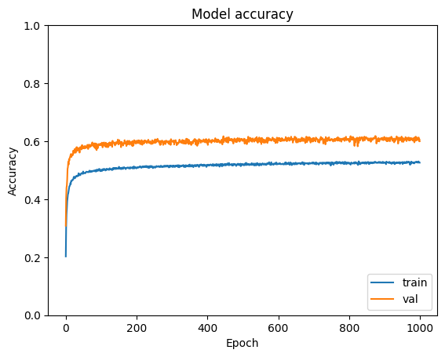
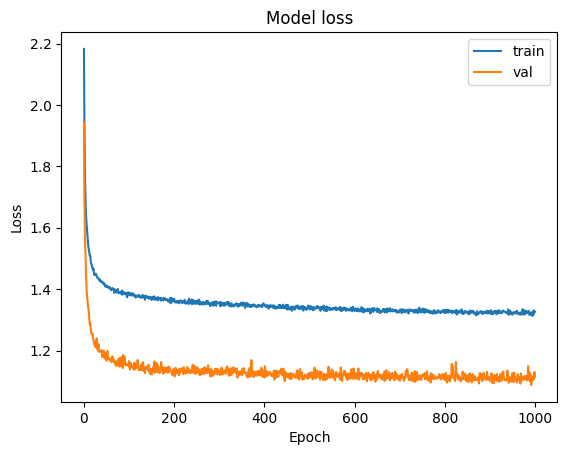
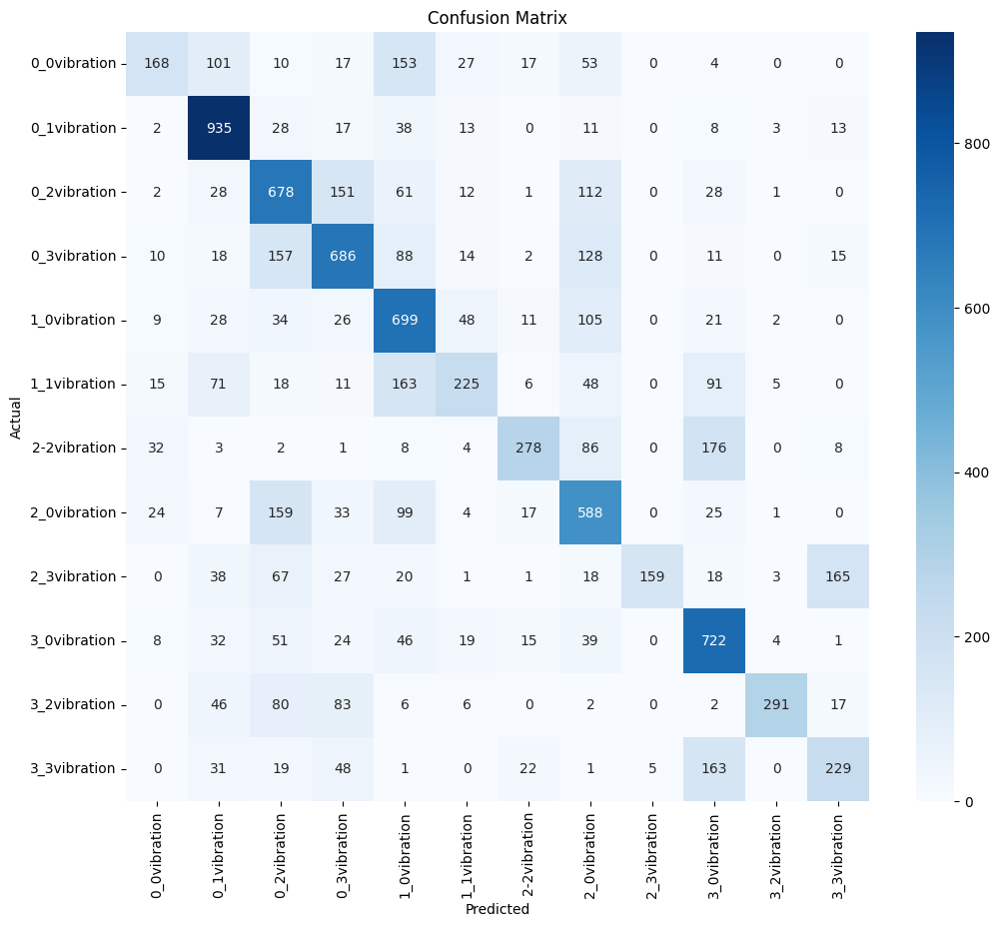

| Class | Precision    | Recall | F1-Score | Support |
| ----- | ------------ | ------ | -------- | ------- |
| 0     | 0.62         | 0.31   | 0.41     | 550     |
| 1     | 0.70         | 0.88   | 0.78     | 1068    |
| 2     | 0.52         | 0.63   | 0.57     | 1074    |
| 3     | 0.61         | 0.61   | 0.61     | 1129    |
| 4     | 0.51         | 0.71   | 0.59     | 983     |
| 5     | 0.60         | 0.34   | 0.44     | 653     |
| 6     | 0.75         | 0.46   | 0.57     | 598     |
| 7     | 0.49         | 0.61   | 0.55     | 957     |
| 8     | 0.97         | 0.31   | 0.47     | 517     |
| 9     | 0.57         | 0.75   | 0.65     | 961     |
| 10    | 0.94         | 0.55   | 0.69     | 533     |
| 11    | 0.51         | 0.44   | 0.47     | 519     |
|       |              |        | Accuracy | 0.59    |
|       | Macro Avg    |        | 0.65     | 9542    |
|       | Weighted Avg |        | 0.62     | 9542    |

# 2. 训练数据为vibration的LSTM模型

- loss和accuracy在训练过程中太不稳定，但accuracy幸运的达到了83%;
- loss和accuracy在训练过程中太不稳定的原因可能是噪音太多了
- 由混淆矩阵和F1-Score可看出除了11vector的判断准确率为54%以外其他的准确率都挺高；
  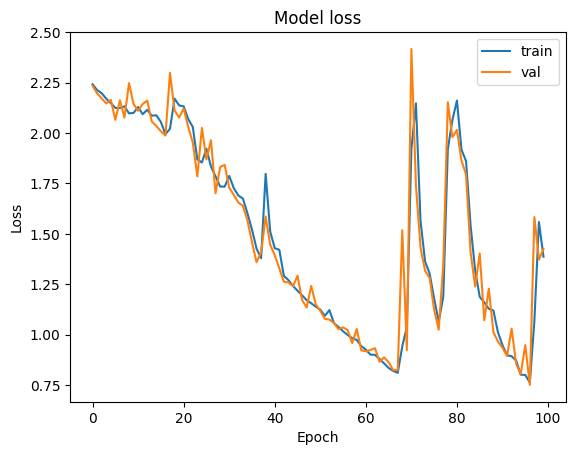
  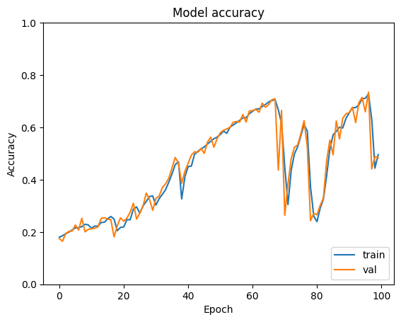
  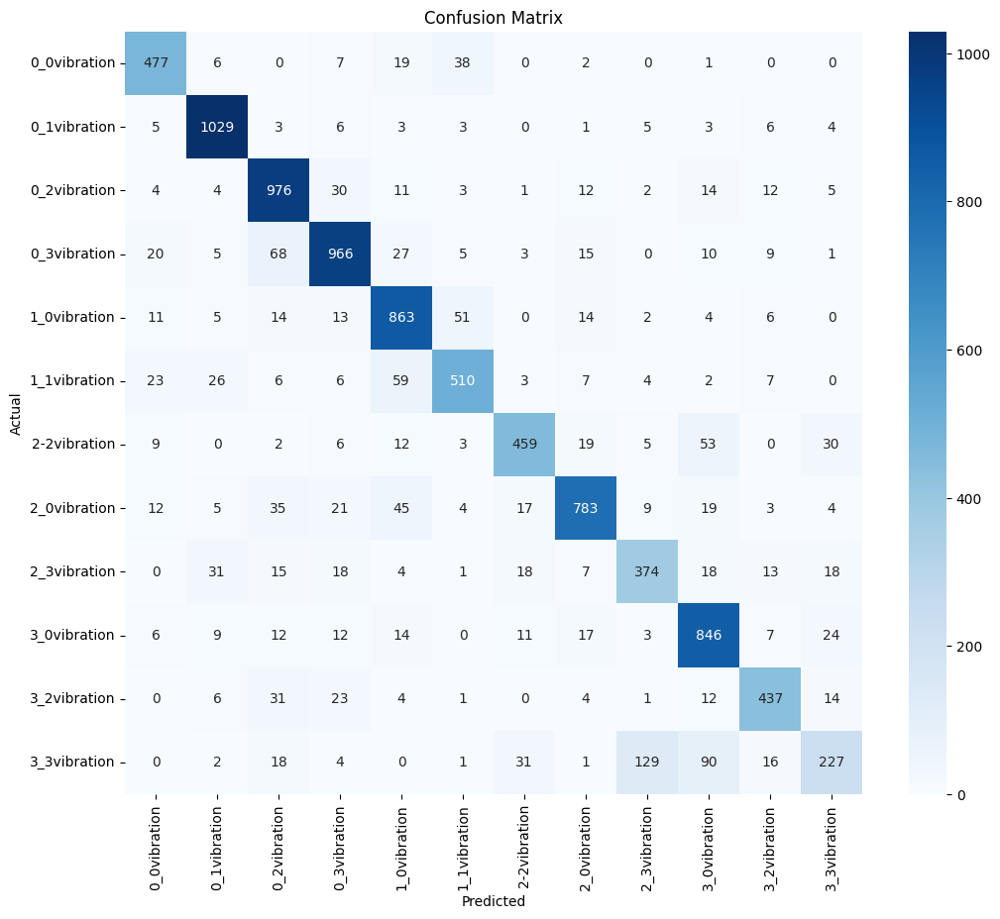

  | Class | Precision    | Recall | F1-Score | Support |
  | ----- | ------------ | ------ | -------- | ------- |
  | 0     | 0.84         | 0.87   | 0.85     | 550     |
  | 1     | 0.91         | 0.96   | 0.94     | 1068    |
  | 2     | 0.83         | 0.91   | 0.87     | 1074    |
  | 3     | 0.87         | 0.86   | 0.86     | 1129    |
  | 4     | 0.81         | 0.88   | 0.84     | 983     |
  | 5     | 0.82         | 0.78   | 0.80     | 653     |
  | 6     | 0.85         | 0.77   | 0.80     | 598     |
  | 7     | 0.89         | 0.82   | 0.85     | 957     |
  | 8     | 0.70         | 0.72   | 0.71     | 517     |
  | 9     | 0.79         | 0.88   | 0.83     | 961     |
  | 10    | 0.85         | 0.82   | 0.83     | 533     |
  | 11    | 0.69         | 0.44   | 0.54     | 519     |
  |       |              |        | Accuracy | 0.83    |
  |       | Macro Avg    |        | 0.82     | 9542    |
  |       | Weighted Avg |        | 0.83     | 9542    |

# 3. 训练数据为pressure的LSTM模型

- loss和accuracy在训练过程中比较稳定，但accuracy却只有73%;
- accuracy在loss和accuracy比较稳定的情况下可以通过增加训练次数来提高；(pressure序列噪音较少)
- 由混淆矩阵和F1-Score可看出大体平均，而且7vector的准确率是100%;
  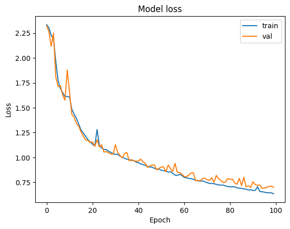
  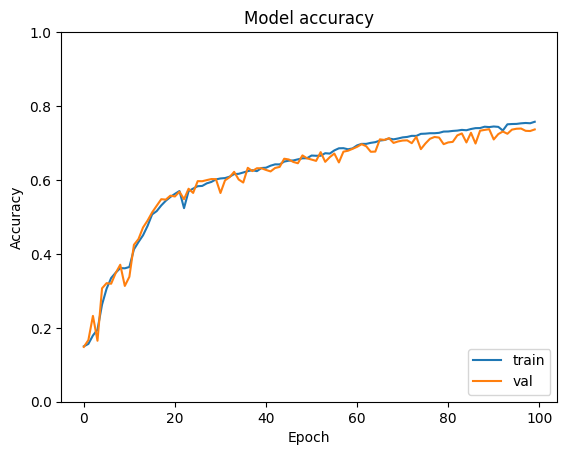
  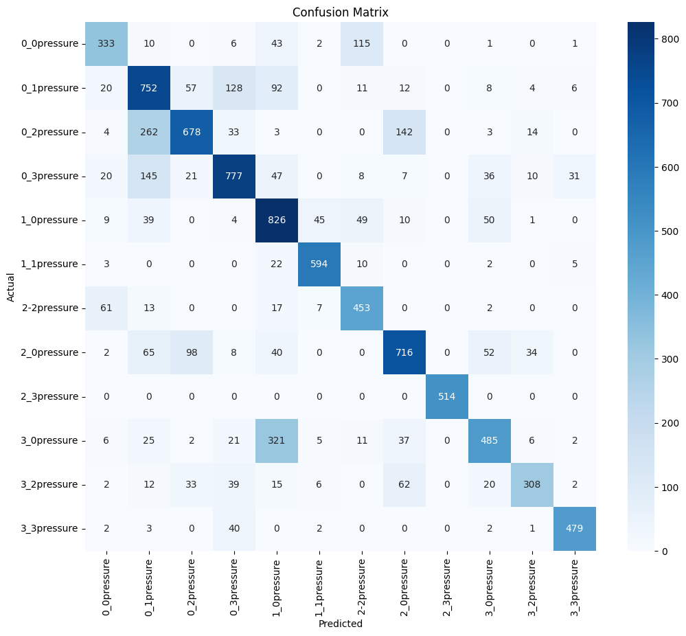

| Class | Precision    | Recall | F1-Score | Support |
| ----- | ------------ | ------ | -------- | ------- |
| 0     | 0.72         | 0.65   | 0.68     | 511     |
| 1     | 0.57         | 0.69   | 0.62     | 1090    |
| 2     | 0.76         | 0.60   | 0.67     | 1139    |
| 3     | 0.74         | 0.71   | 0.72     | 1102    |
| 4     | 0.58         | 0.80   | 0.67     | 1033    |
| 5     | 0.90         | 0.93   | 0.92     | 636     |
| 6     | 0.69         | 0.82   | 0.75     | 553     |
| 7     | 0.73         | 0.71   | 0.72     | 1015    |
| 8     | 1.00         | 1.00   | 1.00     | 514     |
| 9     | 0.73         | 0.53   | 0.61     | 921     |
| 10    | 0.81         | 0.62   | 0.70     | 499     |
| 11    | 0.91         | 0.91   | 0.91     | 529     |
|       |              |        | Accuracy | 0.72    |
|       | Macro Avg    |        | 0.76     | 9542    |
|       | Weighted Avg |        | 0.74     | 9542    |

# 4. 训练数据为strain的LSTM模型

- loss和accuracy在训练过程中局部波动大,且accuracy只有58%;
- 由混淆矩阵的对角线数据并未连续可知，效果非常不好；
- 且在训练过程中60%的准确率似乎是由未降噪的数据导致的；

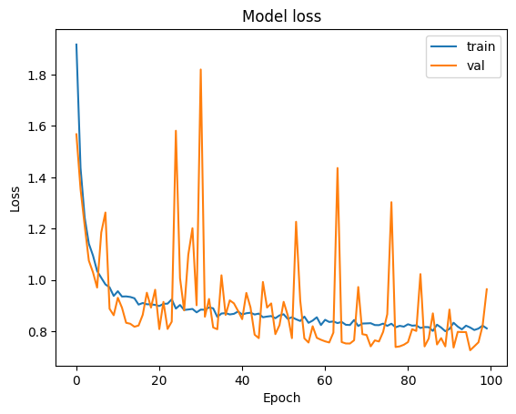
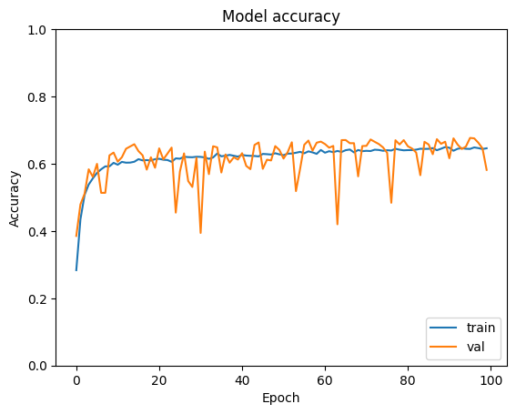
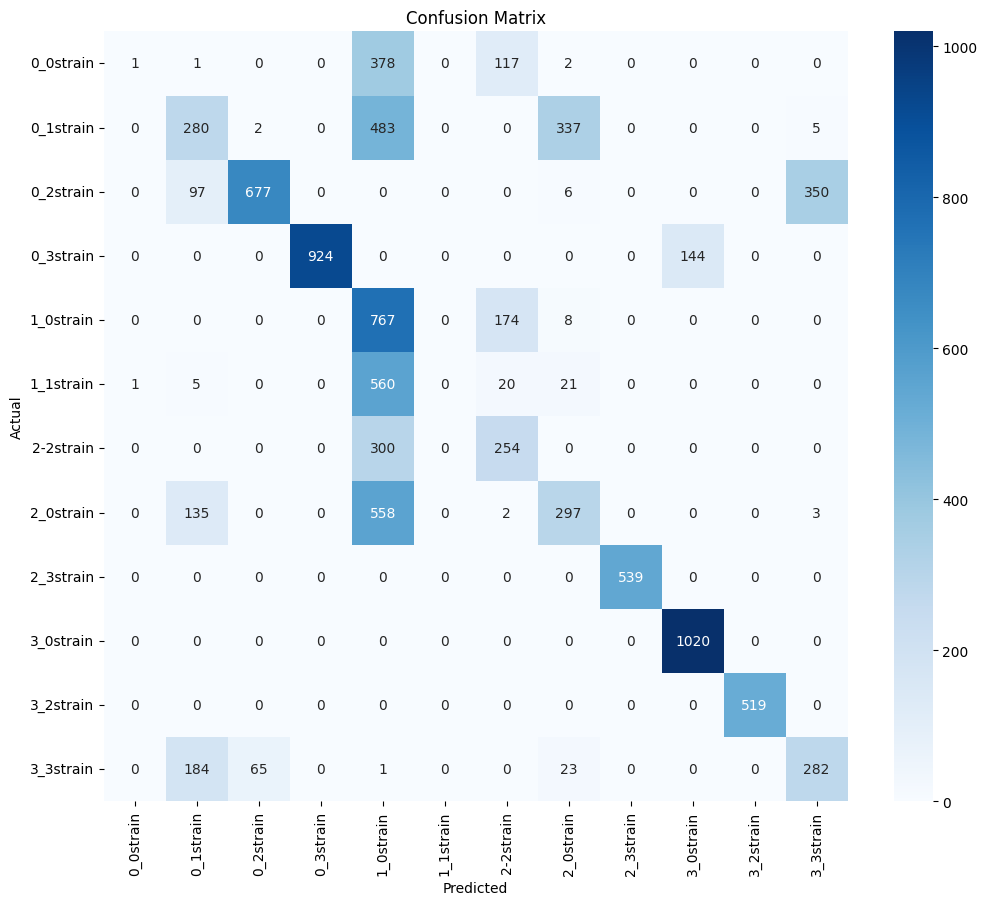

| Class | Precision    | Recall | F1-Score | Support |
| ----- | ------------ | ------ | -------- | ------- |
| 0     | 0.50         | 0.00   | 0.00     | 499     |
| 1     | 0.40         | 0.25   | 0.31     | 1107    |
| 2     | 0.91         | 0.60   | 0.72     | 1130    |
| 3     | 1.00         | 0.87   | 0.93     | 1068    |
| 4     | 0.25         | 0.81   | 0.38     | 949     |
| 5     | 0.00         | 0.00   | 0.00     | 607     |
| 6     | 0.45         | 0.46   | 0.45     | 554     |
| 7     | 0.43         | 0.30   | 0.35     | 995     |
| 8     | 1.00         | 1.00   | 1.00     | 539     |
| 9     | 0.88         | 1.00   | 0.93     | 1020    |
| 10    | 1.00         | 1.00   | 1.00     | 519     |
| 11    | 0.44         | 0.51   | 0.47     | 555     |
|       |              |        | Accuracy | 0.58    |
|       | Macro Avg    |        | 0.60     | 9542    |
|       | Weighted Avg |        | 0.62     | 9542    |

# 5. 训练数据为vibration的EMD-LSTM模型

- loss和accuracy在训练过程中较为平滑，且准确率为76%。且尚未到极限，依然可以通过增加训练次数通过准确率；
- 由混淆矩阵和F1-Score可看出除了11vector的判断准确率为48%以外其他的准确率都挺高；
  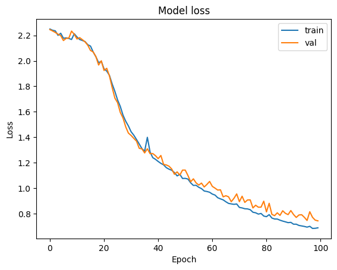
  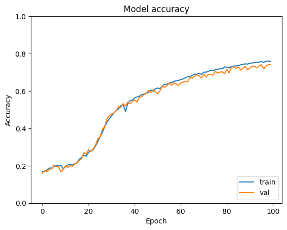
  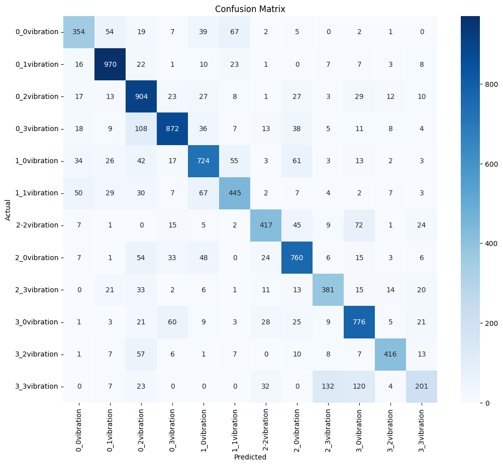

| Class | Precision    | Recall | F1-Score | Support |
| ----- | ------------ | ------ | -------- | ------- |
| 0     | 0.70         | 0.64   | 0.67     | 550     |
| 1     | 0.85         | 0.91   | 0.88     | 1068    |
| 2     | 0.69         | 0.84   | 0.76     | 1074    |
| 3     | 0.84         | 0.77   | 0.80     | 1129    |
| 4     | 0.74         | 0.74   | 0.74     | 983     |
| 5     | 0.72         | 0.68   | 0.70     | 653     |
| 6     | 0.78         | 0.70   | 0.74     | 598     |
| 7     | 0.77         | 0.79   | 0.78     | 957     |
| 8     | 0.67         | 0.74   | 0.70     | 517     |
| 9     | 0.73         | 0.81   | 0.76     | 961     |
| 10    | 0.87         | 0.78   | 0.82     | 533     |
| 11    | 0.64         | 0.39   | 0.48     | 519     |
|       |              |        | Accuracy | 0.76    |
|       | Macro Avg    |        | 0.75     | 9542    |
|       | Weighted Avg |        | 0.76     | 9542    |

# 6. 训练数据为pressure的EMD-LSTM模型

- loss和accuracy在训练过程中不仅波动大，而且准确率巨低29%；
- 混淆矩阵和F1-Score效果极其不好；
- 原因是可能是是pressure序列不适应于EMD降噪，与原始的pressure序列效果相比相差太远了；

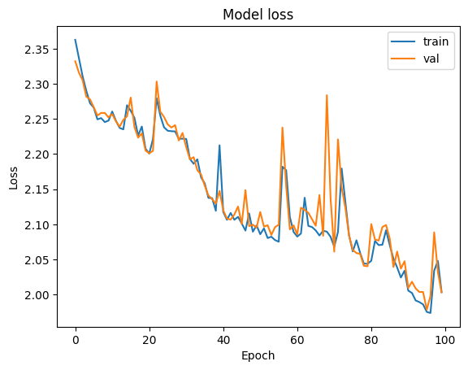
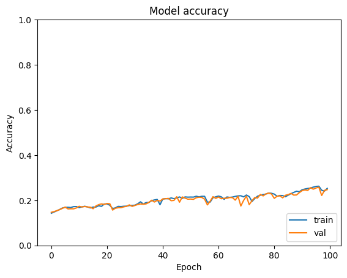
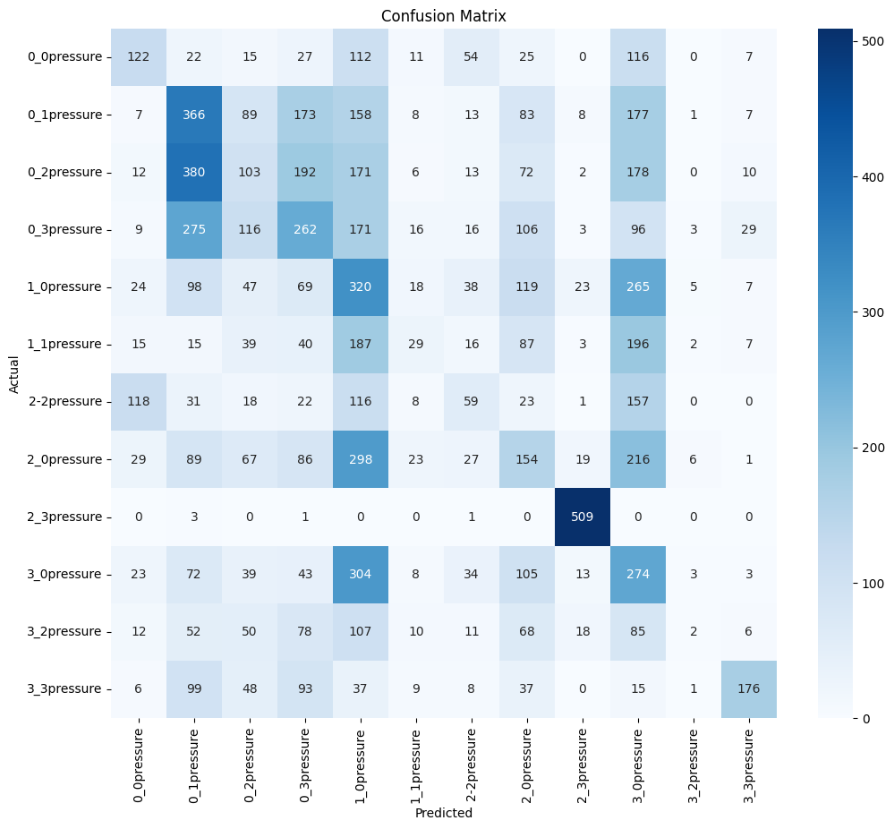

| Class | Precision    | Recall | F1-Score | Support |
| ----- | ------------ | ------ | -------- | ------- |
| 0     | 0.32         | 0.24   | 0.27     | 511     |
| 1     | 0.24         | 0.34   | 0.28     | 1090    |
| 2     | 0.16         | 0.09   | 0.12     | 1139    |
| 3     | 0.24         | 0.24   | 0.24     | 1102    |
| 4     | 0.16         | 0.31   | 0.21     | 1033    |
| 5     | 0.20         | 0.05   | 0.07     | 636     |
| 6     | 0.20         | 0.11   | 0.14     | 553     |
| 7     | 0.18         | 0.15   | 0.16     | 1015    |
| 8     | 0.85         | 0.99   | 0.91     | 514     |
| 9     | 0.15         | 0.30   | 0.20     | 921     |
| 10    | 0.09         | 0.00   | 0.01     | 499     |
| 11    | 0.70         | 0.33   | 0.45     | 529     |
|       |              |        | Accuracy | 0.25    |
|       | Macro Avg    |        | 0.29     | 9542    |
|       | Weighted Avg |        | 0.26     | 9542    |

# 7. 训练数据为strain的EMD-LSTM模型

- loss和accuracy在训练过程中大体稳定但局部波动大，但之前相较于原始数据而已比较Loss与Accuracy的变化过程相对稳定；
- 准确率也从54%提升到了62%，且还未到极限；
- strain序列的EMD降噪效果不错；

  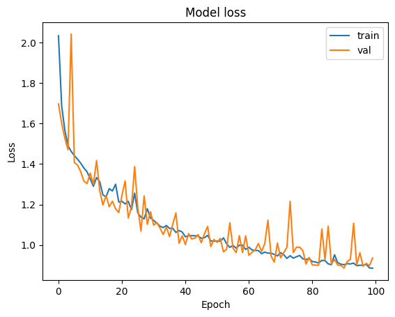
  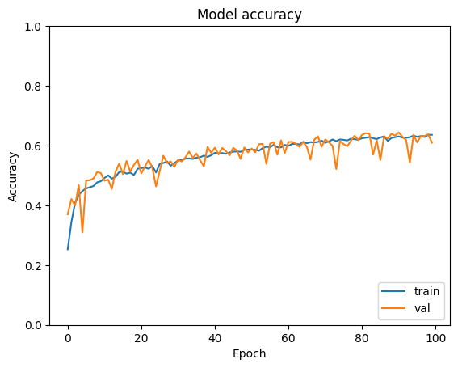
  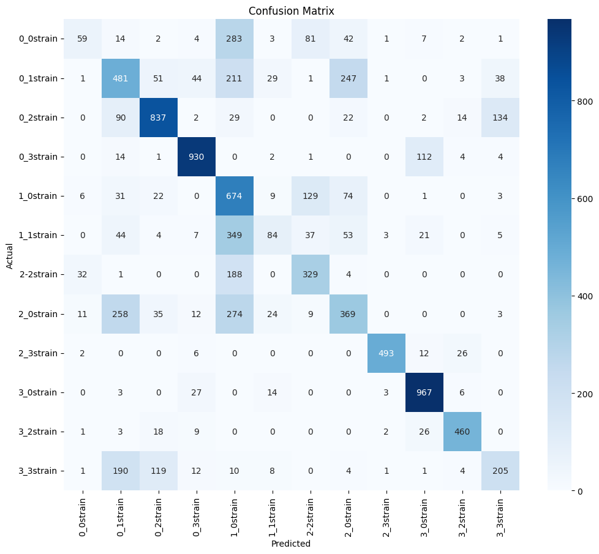

  | Class | Precision    | Recall | F1-Score | Support |
  | ----- | ------------ | ------ | -------- | ------- |
  | 0     | 0.52         | 0.12   | 0.19     | 499     |
  | 1     | 0.43         | 0.43   | 0.43     | 1107    |
  | 2     | 0.77         | 0.74   | 0.75     | 1130    |
  | 3     | 0.88         | 0.87   | 0.88     | 1068    |
  | 4     | 0.33         | 0.71   | 0.45     | 949     |
  | 5     | 0.49         | 0.14   | 0.22     | 607     |
  | 6     | 0.56         | 0.59   | 0.58     | 554     |
  | 7     | 0.45         | 0.37   | 0.41     | 995     |
  | 8     | 0.98         | 0.91   | 0.95     | 539     |
  | 9     | 0.84         | 0.95   | 0.89     | 1020    |
  | 10    | 0.89         | 0.89   | 0.89     | 519     |
  | 11    | 0.52         | 0.37   | 0.43     | 555     |
  |       |              |        | Accuracy | 0.62    |
  |       | Macro Avg    |        | 0.64     | 9542    |
  |       | Weighted Avg |        | 0.63     | 9542    |

# 7. 训练数据为vibration/pressure/strain的CNN模型
- CNN的loss和accuracy效果太差了，证明vibration/pressure/strain基本上没有空间上的相关性；
  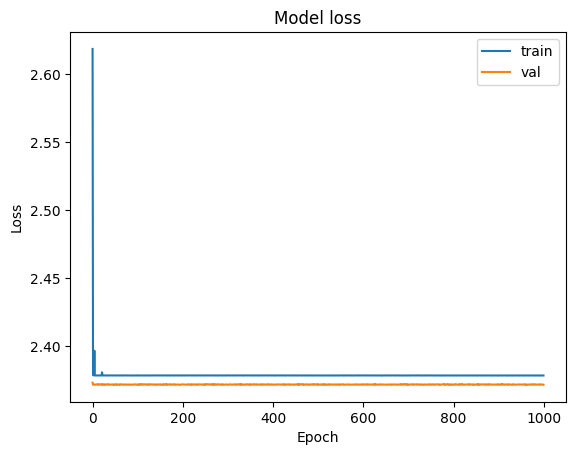
  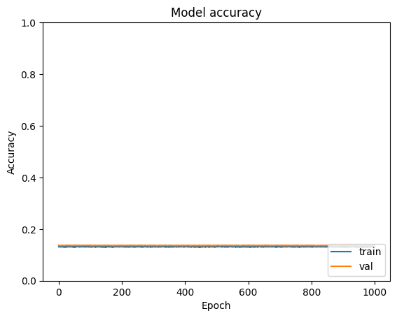
  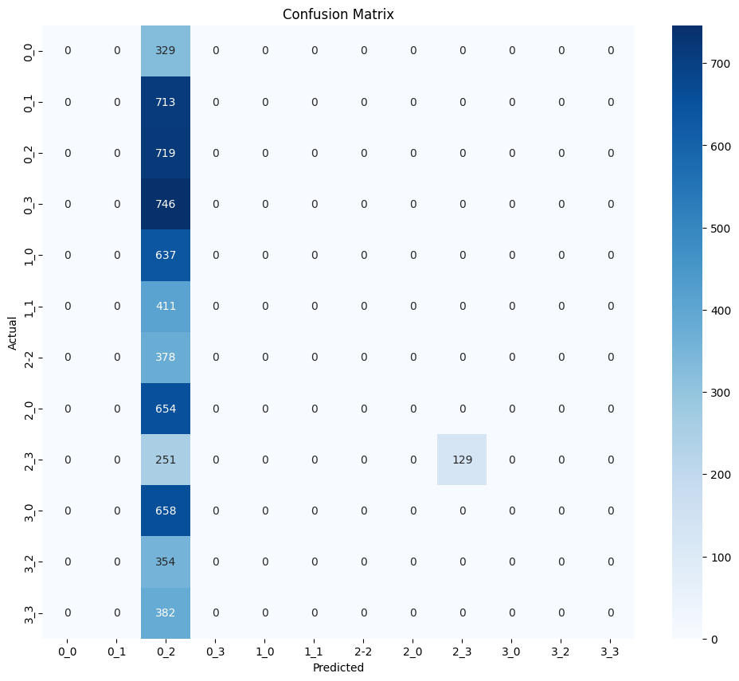